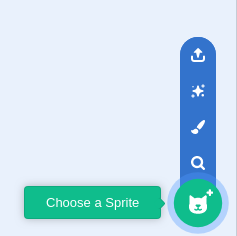

## Setting the stage

To being creating your Video Dance project, you are going to need to find a backdrop and position your sprites on the stage.

--- task ---
--- task ---
Open a new Scratch project.

**Online:** open a new online Scratch project at [rpf.io/scratch-new](http://rpf.io/scratch-new){:target="_blank"}.

**Offline:** open a new project in the offline editor.

If you need to download and install the Scratch offline editor, you can find it at [rpf.io/scratchoff](http://rpf.io/scratchoff){:target="_blank"}.
--- /task ---

--- task ---
Click on the `Choose a backdrop` icon in the bottom right hand corner of the screen, and then select a backdrop for your dancer to use.

--- /task ---

--- task ---
Delete the Scratch cat sprite, by clicking on the trashcan, and then choose a new sprite to be your dancer.

--- /task ---

--- task ---
Click on the `Dance` button and you will see several sprites to choose from.

--- /task ---

--- task ---
Click in the `Costumes` tab. Have a look at all the different costumes for your dancer, and delete all but four of them. These four costumes will be your dancer's moves.

--- /task ---

--- task ---
You can set the size of your dancer, so that she doesn't appear to large on the stage.

--- /task ---

Next you're going to draw some *pads* on the screen, that will be used by the player to act out their own dance moves.

--- task ---
Paint a new sprite, by selecting `Paint` for the `Choose a Sprite` menu.

--- /task ---

--- task ---
You can draw a circle on the canvas, using the `Circle` tool. Hold down the `Shift` key as you draw to make sure it is a regular circle.

--- /task ---

--- task ---
Duplicate the sprite's costume so that there are 5 different costumes.

--- /task ---

--- task ---
Change the fill colour for each of the costumes using the `Fill` drop down menu to choose a colour, and the `Fill` tool to colour the circles.

--- /task ---

That's all the graphics completed, for now, so you can now move on to the next step and begin programming the game.
