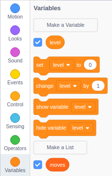

## Making the sprite dance

In this step you will make the sprite dance randomly on the stage. To do this you will place random numbers into a list. The dancer will then change their costume and a sound will play depending on that random number.

--- task ---
use the `Variables`{:class="block3variables"} menu to create a new variable and a list. The variable should be called `level`{:class="block3variables"} and the list should be called `moves`{:class="block3variables"}


--- /task ---

--- task ---
The first few blocks will be used to start the game. The `level`{:class="block3variables"} will be set to `1`{:class="block3variables"} and the `moves`{:class="block3variables"} will be reset.


```blocks3
when flag clicked
wait (1) seconds
set [level v] to (1)
forever
delete all of [moves v]
repeat (level)
```
--- /task ---

Now a random number (between 1 and 4) can be added to the `moves`{:class="block3variable"} list. As we know this number is at the end of the `moves`{:class="block3variables"} list, we know it's position is the same as the length of the list.

It will be useful to store this random number, so that it can be easily used in the rest of the program, so a new `variable`{:class="block3variables"} will need to be created.

--- task ---
Create a new variable and call it `move`{:class="block3variables"}.
--- /task ---

--- task ---
Now you can add a random number to the list and then set the value of `move`{:class="block3variable"} to this number


```blocks3
when flag clicked
wait (1) seconds
set [level v] to (1)
forever
delete all of [moves v]
repeat (level)
+add (pick random (1) to (4)) to [moves v]
+set [move v] to (item (length of [moves v]) of [moves v])
```
--- /task ---

--- task ---
Add a block to make the costume change to the same number as `move`{:class="block3variables"}.


```blocks3
when flag clicked
wait (1) seconds
set [level v] to (1)
forever
delete all of [moves v]
repeat (level)
add (pick random (1) to (4)) to [moves v]
set [move v] to (item (length of [moves v]) of [moves v])
+switch costume to (move)
```
--- /task ---

For the next part you will need to add the Music extension.

[[[generic-scratch3-add-music-extension]]]

--- task ---
Create a new variable called `beats`{:class="block3variables"}. It can be set to `1`{:class="block3variables"} to begin with. This will be used to control the tempo of the drum beats. Then add a block to play a drum beat.


```blocks3
when flag clicked
wait (1) seconds
set [level v] to (1)
+set [beats v] to (1)
forever
delete all of [moves v]
repeat (level)
add (pick random (1) to (4)) to [moves v]
set [move v] to (item (length of [moves v]) of [moves v])
switch costume to (move)
+play drum (move) for (beats) beats
```
--- /task ---

--- task ---
Click the green flag and you should see your sprite dancing.
--- /task ---
