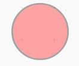
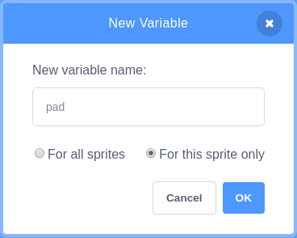

## Getting the player to dance

Now it's time for the player to try and have a go at dancing, and give them some clues as to what moves they need to do.

--- task ---
Add some blocks to tell the player that it is their turn to play and then add in a `broadcase`{:class="block3events"} to signal this to other sprites.


```blocks3
when flag clicked
wait (1) seconds
set [level v] to (1)
set [beats v] to (1)
forever
delete all of [moves v]
repeat (level)
add (pick random (1) to (4)) to [moves v]
set [move v] to (item (length of [moves v]) of [moves v])
switch costume to (move)
play drum (move) for (beats) beats
end
+say [now it's your turn] for (1) seconds
+broadcast [start dancing v]
```
--- /task ---

The next set of code blocks will be added to the circle sprite you made at the start.

--- task ---
Begin by starting the script by receiving the broadcast.


```blocks3
when I receive [start dancing v]
```
--- /task ---

Variable in Scratch come in two varieties. One that is a variable that all Sprites can use, and the other is a variable that only the sprite it was created for can use.

--- task ---
Create a variable called `pad`{:class="block3variables"}, and make sure it is `For this Sprite only`



The variable can be set to a value of `1`{:class="block3variables"}


```blocks3
when I receive [start dancing v]
+set [pad v] to (1)
```
--- /task ---

--- task ---
Next create a new list called `actions`{:class="block3variables"}. This is where all the player's actions will be stored as they dance.
--- /task ---

At the moment, the `moves`{:class="block3variables"} list contains only one random number. As the game gets more difficult though, more random numbers will be added.

If the players actions are being stored in the `actions`{:class="block3variables"} list, then we know that when the two lists are the same size, the player has finished that round of dancing.

--- task ---
Use a `repeat until`{:class="block3control"} block to keep the pscript running until the two lists are of equal length.


```blocks3
when I receive [start dancing v]
set [pad v] to (1)
+ repeat until <(length of [actions v]) = (length of [moves v])>
```
--- /task ---

The Video sensing extension lets you detect if there is movement over a sprite.

--- task ---
Add the Video sensing extension in the same way you added the Music extension
--- /task ---

--- task ---
Create a new variable called `sensitivity`{:class="block3variables"}. (This should be for all sprites). This will be used to adjust how sensitive your sprites are to the video motion.
--- /task ---

--- task ---
Now you can check to see if the `video motion`{:class="block3extension"} is greater than the `sensitivity`{:class="block3variables"}


```blocks3
when I receive [start dancing v]
set [pad v] to (1)
repeat until <(length of [actions v]) = ()>
+if  <(video [motion v] on [sprite v]) > (length of [moves v])> then
```
--- /task ---

--- task ---
If it is then the player has "touched" the sprite and so you can add the `pad`{:class="block3variables"} value into the `actions`{:class="block3variables"} list, and then play a drum beat.


```blocks3
when I receive [start dancing v]
set [pad v] to (1)
repeat until <(length of [actions v]) = ()>
if  <(video [motion v] on [sprite v]) > (length of [moves v])> then
+add (pad) to [actions v]
+play drum (pad) for (beats) beats
```
--- /task ---
