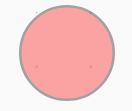

## More pads

You're going to need four more additional pads. Four pads in total will be used to detect the player's dance moves, and one will tell them which colour pads they need to use.

--- task ---
Rename your circular sprite so that it is called `pad1`, then right click and duplicate it four times. Each sprite should be renamed `pad2`, `pad3` etc.
--- /task ---

--- task ---
Use the costumes tab to choose a different starting colour for each pad, and then position them around the stage. One pad should be white and postioned at the bottom.


--- /task ---

--- task ---
For each of the coloured pads, you need to make sure that their `pad`{:class="block3variables"} variable is set to the same number as the sprite name. So for instance `pad2` has it's script slightly changed so that the `pad`{:class="block3variables"} is set to `2`{:class="block3variables"}


```blocks3
when I receive [start dancing v]
+set [pad v] to (2)
repeat until <(length of [actions v]) = ()>
if  <(video [motion v] on [sprite v]) > (length of [moves v])> then
add (pad) to [actions v]
play drum (pad) for (beats) beats
```
--- /task ---

--- task ---
The bottom pad (`pad5`) will have some scripts added later, so for now just delete all the scripts for that sprite.
--- /task ---

Now each pad will play a different drum beat when it is touched, and will add the value of it's own `pad`{:class="block3variables"} variable to the `actions`{:class="block3variables"} list.
