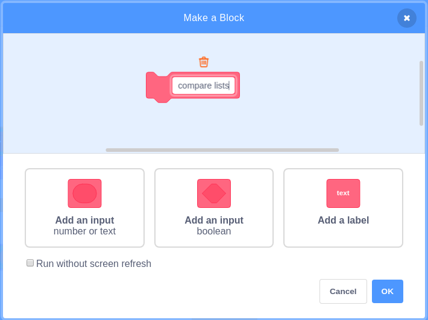
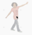

## Uping the level

Now thart you have all the pads set up, it's time to check if the player has 'touched' the correct pad when they made their dance move. If they did then the level can be increased. Increasing the level will add more moves into the `moves`{:class="block3variables"} list, and so the game will keep getting more and more difficult.

To check if the player has touched the correct pads, you will need to compare each item in the `moves`{:class="block3variables"} and `actions`{:class="block3variables"} lists. If they have danced correctly, the first items in each list will be the same number. As the game gets more difficult, the second, third, fouth numbers should all be the same as each other.

To do this, you're going to create a custom block that will compare the items in any two lists. This will be on the dancer sprite.

--- task ---
In the `my blocks`{:class="block3myblocks"} menu, click on `Make a block`, and call your new block `compare lists`{:class="block3"}

--- /task ---

Once you click `OK` your new block will be available to use, and you should see a block like this appear in your scripts area.


```blocks3
define compare lists
```

You need a variable to keep track of which items in the two lists you want to compare with each other.

--- task ---
Create a new variable called `index`{:class="block3variables"} and set it's value to `1`{:class="block3variables"}.


```blocks3
define compare lists
+set [index v] to (1)
```
--- /task ---

You're script is going to need to check through the lists until it reaches the end. This means it will need to repeat for as many items there are in either lists.

--- task ---
Add a `repeat`{:class="block3control"} block to your script.


```blocks3
define compare lists
set [index v] to (1)
+repeat (length of [actions v])
```
--- /task ---

Now you need to keep comparing the items in each list at the position of `index`{:class="block3variables"}. If the items in `actions`{:class="block3variables"} and `moves`{:class="block3variables"} do not match, then the game can end. If they do match then the `index`{:class="block3variables"} can be increased.

--- task ---
Begin by comparing the two items at `index`{:class="block3variables"}, to see if they are equal. Build this block outside of any of the scripts.


```blocks3
<(item (index) of [actions v]) = (item (index) of [moves v])>
```
--- /task ---

--- task ---
Now place it inside a `not`{:class="block3operators"} block, to check if they are not equal.


```blocks3
<not <(item (index) of [actions v]) = (item (index) of [moves v])>>
```
--- /task ---

--- task ---
This can then be placed into an `if then`{:class="block3variables"}, so that if they are not equal, the game ends, but if they are equal the `index`{:class="block3variables"} increases by 1.


```blocks3
define compare lists
set [index v] to (1)
repeat (length of [actions v])
+if <not <(item (index) of [actions v]) = (item (index) of [moves v])>> then
say (join[well done you reached level ](level)
stop [all v]
end
+change (index) by (1)
```
--- /task ---

--- task ---
Once the `repeat`{:class="block3variables"} loop has ended, you know that the lists are both the same, so you can congratulate the player and increase the level.


```blocks3
define compare lists
set [index v] to (1)
repeat (length of [actions v])
+if <not <(item (index) of [actions v]) = (item (index) of [moves v])>> then
say (join[well done you reached level ](level)
stop [all v]
end
+change (index) by (1)
end
+change [level v] by (1)
+say (join[well done, now try level ](level)
```
--- /task ---

--- task ---
Click the green flag and have a play at touching the right pads. You'll probably find the game a little difficult at the moment, so in the next step you will add some scripts to give the players a visual clue as to which pads to hit.
--- /task ---
