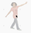
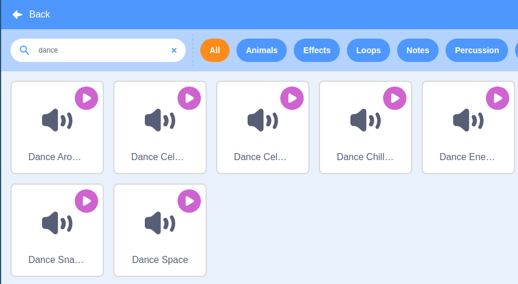

## Give them a clue

Pad5 will be used to tell the player which colour pad to hit, by changing colour, as the sprite dances. To do this it will need to know when a dance move has been made.

--- task ---
On the dancer sprite, add in a `broadcast`{:class="block3events"} block.


```blocks3
when flag clicked
wait (1) seconds
set [level v] to (1)
set [beats v] to (1)
forever
delete all of [moves v]
repeat (level)
add (pick random (1) to (4)) to [moves v]
set [move v] to (item (length of [moves v]) of [moves v])
+broadcast [move v]
switch costume to (move)
play drum (move) for (beats) beats
end
say [now it's your turn] for (1) seconds
broadcast [start dancing v]
wait until <(length of [actions v]) = (length of [moves v])>
compare lists ::custom
```
--- /task ---

Now switch to the pad5 sprite. When it receives the `moved`{:class="block3events"} broadcast it will change it's size and colour to indicate the `move`{:class="block3variables"} that the dancer has just performed. This will then tell the player, which pads they need to hit and in which order.

--- task ---
Add this script to the pad5 sprite.

```blocks
when I receive [moved v]
switch costume to [costume5]
change size by (5)
switch costume to (move)
wait (0.2) seconds
set size to (100) %
```
--- /task ---

--- task ---
Then when the game starts you can reset the sprite

```blocks3
when flag clicked
set size to (100) %
switch costume to [costume5]
```
--- /task ---

To complete your game, you'll want to add some music.

--- task ---
Open the sounds tab on the pad5 sprite. Add a music loop that you like the sound of.


--- /task ---

--- task ---
Now add blocks to play the sound when the game starts.


```blocks3
when flag clicked
set size to (100) %
switch costume to [costume5]
+ forever
play sound [dance around v] until done
```
--- /task ---

That's your game complete. Click the green flag and watch pad5 to see which pads you need to reach for when it is your turn. Dance around and see how high a level you can reach
